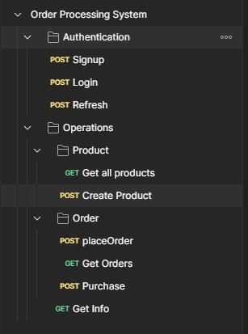

# Order Processing System Documentation

## Introduction
This documentation provides instructions on setting up and running the Order Processing System, a simplified solution for managing orders in an online store. The system handles various aspects of order processing, including stock management, payment processing, sending order confirmation emails, and error handling.

## Setup

### Docker Setup
To run the Order Processing System using Docker, follow these steps:

1. Clone the repository:
   ```bash
   git clone <repository_url>
   cd order-processing-system
   ```

2. Build the Docker image:
   ```bash
   docker build -t order-processing-system .
   ```

3. Run the Docker container:
   ```bash
   docker run -p 8000:8000 order-processing-system
   ```

### Virtual Environment Setup
If you prefer not to use Docker, you can set up the project using a virtual environment. Follow these steps:

1. Clone the repository:
   ```bash
   git clone <repository_url>
   cd order-processing-system
   ```

2. Create and activate a virtual environment:
   ```bash
   python3 -m venv venv
   source venv/bin/activate  # for Linux/macOS
   # or
   venv\Scripts\activate  # for Windows
   ```

3. Install dependencies:
   ```bash
   pip install -r requirements.txt
   pip install djangorestframework_simplejwt
   ```

4. Run the Django server:
   ```bash
   python manage.py runserver
   ```

## Dependencies
The Order Processing System relies on the following dependencies:
- Django: Web framework for building the application.
- Django REST Framework (DRF): Toolkit for building Web APIs.
- Requests: HTTP library for making requests to external services.
- Django REST Framework SimpleJWT: Library for JWT authentication.

## Endpoints

### 1. `/products/`

- **Method:** GET
- **Description:** Retrieve a list of all products.
- **Notes:**
  - Requires authentication.
  - Only authenticated users can access this endpoint.
- **Example:**
  ```http
  GET /products/
  ```
  **Response:**
  ```json
  [
    {
      "id": 1,
      "name": "Product A",
      "description": "Description of Product A",
      "price": 50.00,
      "stock": 100
    },
    {
      "id": 2,
      "name": "Product B",
      "description": "Description of Product B",
      "price": 30.00,
      "stock": 50
    }
  ]
  ```

### 2. `/place_order/`

- **Method:** POST
- **Description:** Place a new order.
- **Notes:**
  - Requires authentication.
  - Only authenticated users can access this endpoint.
  - Requires providing a list of items in the request body.
- **Example:**
  ```http
  POST /place_order/
  ```
  **Request Body:**
  ```json
  {
    "items": [
      {"productName": "Product A", "quantity": 2},
      {"productName": "Product B", "quantity": 1}
    ]
  }
  ```
  **Response:**
  ```json
  {
    "id": 1,
    "customer": "username",
    "total_amount": 130.00,
    "paid": false,
    "created_at": "2024-05-04T12:00:00Z"
  }
  ```

### 3. `/orders/`

- **Method:** GET
- **Description:** Retrieve a list of orders placed by the authenticated user.
- **Notes:**
  - Requires authentication.
  - Only authenticated users can access this endpoint.
- **Example:**
  ```http
  GET /orders/
  ```
  **Response:**
  ```json
  [
    {
      "id": 1,
      "customer": "username",
      "total_amount": 130.00,
      "paid": false,
      "created_at": "2024-05-04T12:00:00Z"
    }
  ]
  ```

### 4. `/make_payment/`

- **Method:** POST
- **Description:** Process payment for an order.
- **Notes:**
  - Requires authentication.
  - Only authenticated users can access this endpoint.
  - Requires providing order ID in the request body.
- **Example:**
  ```http
  POST /make_payment/
  ```
  **Request Body:**
  ```json
  {
    "order_id": 1,
    "amount": 130.00,
    "card_number": "1234567890123456",
    "expiry_date": "12/24",
    "cvv": "123"
  }
  ```
  **Response:**
  ```json
  {
    "message": "Payment successful",
    "order_data": {
      "order_id": 1,
      "total_amount": 130.00,
      "created_at": "2024-05-04T12:00:00Z",
      "items": [
        {
          "product": "Product A",
          "price": 50.00,
          "quantity": 2,
          "totalprice": 100.00
        },
        {
          "product": "Product B",
          "price": 30.00,
          "quantity": 1,
          "totalprice": 30.00
        }
      ]
    }
  }
  ```

### 5. `/orders/`

- **Method:** GET
- **Description:** Retrieve a list of orders belonging to the authenticated user.
- **Notes:**
  - Requires authentication.
  - Only authenticated users can access this endpoint.
  - Returns orders filtered by the authenticated user.
- **Example:**
  ```http
  GET /orders/
  ```
  **Response:**
  ```json
  [
    {
      "id": 1,
      "customer": "username",
      "total_amount": 130.00,
      "paid": false,
      "created_at": "2024-05-04T12:00:00Z"
    }
  ]
  ```

### Postman Documentation
For detailed documentation and testing of the endpoints, refer to the [Postman documentation](https://www.postman.com/winter-meteor-327606/workspace/appgain-backendtask/collection/31151980-17fc9f0b-5c38-46d6-ab25-2a0e2cbe5893?action=share&creator=31151980).



## Docker Hub
This is the Docker Hub repository containing the latest Docker image of the Order Processing System.
[Docker Hub Submission](https://hub.docker.com/layers/heshamabedelatty/orderprocessingsystem/latest/images/sha256:eb6c8e565458978e28e175ba9a8b1f4a0ed519b2b416e87eb97b186a02ede107?uuid=6FE18E5C-6512-470D-8941-547B5CDC0CEE)


## Additional Features
- **User Authentication:** Basic user authentication is implemented to ensure only registered users can place orders.
- **Customization:** Email templates for order confirmation emails can be customized.


